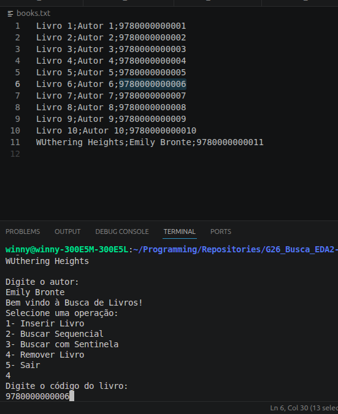
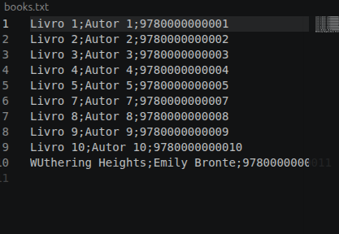
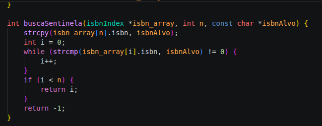

# Simulação de Busca e Ordenação de Livros

Conteúdo da Disciplina:
- Busca Sequencial
- Ordenação de Registros em Arquivo

## Alunos
|Matrícula | Aluno |
| 222006490 | Vinícius de Jesus Bessa Fernandes |
| 202017049  |  Pedro Lucas Figueiredo Santana |

## O que neste repositório é de Busca
- `main.c`: menu principal do trabalho de busca
- `linear_search.h`: busca linear e busca com sentinela
- `get_indexes.h`: leitura do arquivo e criação de índices por ISBN, título e autor
- `add_book.h`, `remove_book.h`, `refresh_append.h`: manutenção do arquivo `books.txt`
- `generate_data.h`: geração da base inicial
- `test/busca_linear_sentinela.c`: exemplos extras de buscas lineares

## O que foi adicionado para Ordenação
- `sorting_main.c`: menu principal da parte de ordenação
- `sorting_support.h`: leitura, cópia, embaralhamento e impressão dos livros
- `sorting_algorithms.h`: implementação de 9 algoritmos

Algoritmos implementados:
- Bubble Sort
- Selection Sort
- Insertion Sort
- Shell Sort
- Quick Sort
- Heap Sort
- Merge Sort
- Counting Sort
- Radix Sort

Todos ordenam os livros pelo campo `ISBN`.

## Screenshots

## Como rodar a Busca
Linguagem: C

Inicie com:
gcc main.c -o main
./main

Siga os passos indicados pelo terminal;

## Como rodar a Ordenação
Compile:
gcc sorting_main.c -o sorting_main

Execute:
./sorting_main

Opções mais úteis:
- `10`: demonstra Radix Sort com antes e depois
- `11`: compara os 9 algoritmos no mesmo conjunto de livros

## Explicação curta para apresentar
- A parte de Busca trabalha com livros salvos em `books.txt` e pesquisa os registros usando busca linear e busca com sentinela.
- A parte de Ordenação usa os mesmos livros, embaralha uma cópia em memória e depois ordena pelo ISBN.
- No menu de comparação, cada algoritmo recebe a mesma entrada para facilitar a análise de desempenho.

## Vídeos
- [Gravação final explicando o projeto - YouTube](https://youtu.be/V84mxaMgRB4)
- [Vídeo anterior explicando a parte de Busca - YouTube](https://youtu.be/RfvAWosSif8)
